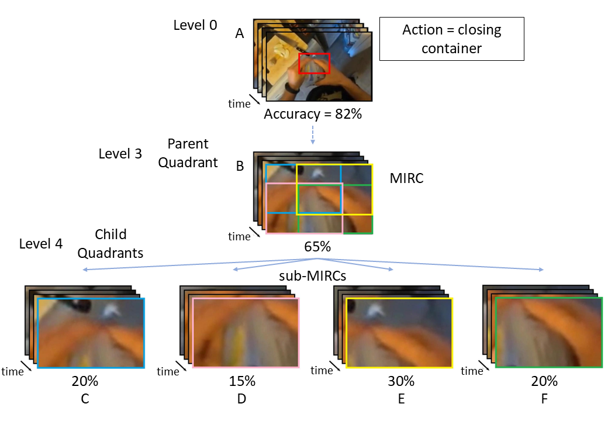

# Epic-ReduAct Dataset

We carefully curated a dataset to compare human and AI vision capabilities, called **Epic-ReduAct**. This dataset is derived from the standard egocentric kitchen activity dataset, [EPIC-KITCHENS-100](https://epic-kitchens.github.io/2025), and systematically reduces both spatial and temporal information.

## Overview

To enable our investigation, we first created **Easy** and **Hard** subsets of the EPIC-KITCHENS dataset to represent different levels of activity recognition difficulty for AI models. Each subset comprises 18 EPIC-KITCHENS videos with a mean duration of **2.35 seconds** (Standard Deviation = **1.11s**), enabling comparisons between human and AI model performance across distinct difficulty levels.

## Dataset Structure


### Table of Dataset Splits

| Category | Videos | Samples | MIRCs | sub-MIRCs | Verb Classes |
|----------|----------|----------|----------|----------|----------|
| Easy  | 18 | 4503 | 273  | 1092  | close, cut, hang, open, pour, put, remove, take, turn-off, turn-on, wash  |
| Hard  | 18  | 3173  | 201  | 804 | close, hang, insert, open, peel, pour, put, remove, serve, take, turn-off, wash  |

We then conducted experiments to systematically reduce the spatial information in the 18 Easy and 18 Hard videos (36 total) across eight hierarchical levels to identify **MIRCs** (Minimally Identifiable Recognition Components). 

The cropping process is illustrated below for a video with the ground truth label `close`. 
- At **Level 0**, we spatially cropped a region of the video that best encompassed its entirety. 
- At **Level 1**, frames from each parent video were cropped at the four corners, generating four child sub-videos per original. (40% of width and height of the parent is cropped out)
- **Levels 2 through 7** involved recursively applying this corner-cropping method to each subsequent generation of parent videos. (30% of width and height of the parent is cropped out)


### Cropping Process Illustration



---

### Cropped area for three different levels


## Annotation Guidelines

There are two annotation files included:
- `Epic-ReduAct_annotations.csv`: Contains the main annotations for each video.
- `MIRCs_subMIRCs.csv`: Shows MIRC and sub-MIRC pairs.

## Download Videos

To download the video files (including two ZIP files for Easy and Hard videos), clone the [HuggingFace repository](https://huggingface.co/datasets/SadeghRahmaniB/Epic-ReduAct) using Git LFS:

```bash
git lfs install
git clone https://huggingface.co/datasets/SadeghRahmaniB/Epic-ReduAct
```

## Citation

```bash
@inproceedings{Rahmani:HumanvsMachine:CVPRWS:2025,
  author = {Rahmani, Sadegh and Rybansky, Filip and Vuong, Quoc and Guerin, Frank and Gilbert, Andrew},
  title = {Human vs. Machine Minds: Ego-Centric Action Recognition Compared},
  booktitle = {IEEE/CVF Conference on Computer Vision and Pattern Recognition - Workshop on Multimodal Algorithmic Reasoning (MAR'25)},
  year = {2025}
}
```
